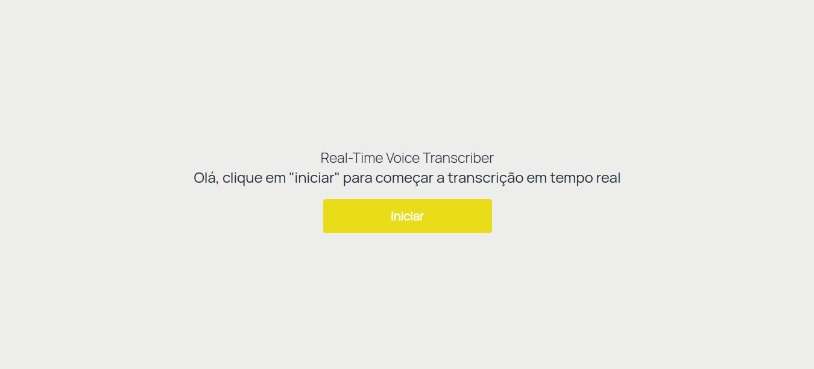
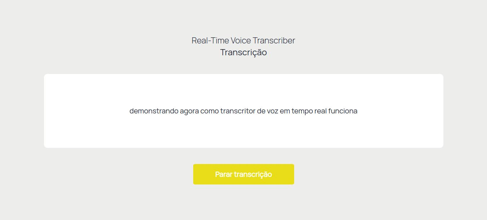
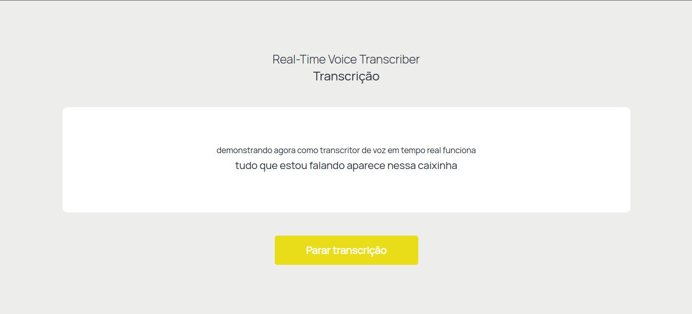

# Real Time Voice Transcriber
Este repositório contém um aplicativo web desenvolvido como uma proposta de prática pedagógica para alunos surdos e deficientes auditivos. A ideia é que os alunos possam usar o aplicativo como um auxílio durante as aulas em classes regulares. O aplicativo realiza uma transcrição em tempo real do que é falado e exibe o texto, permitindo assim que o aluno acompanhe a fala do professor.

## Como Usar

Para utilizar o projeto, é necessário ter o Python 3.x instalado e seguir os seguintes passos:

- Clonar o repositório para o seu computador
- Instalar as dependências necessárias através do comando pip install -r requirements.txt
- Executar o servidor Django através do comando python manage.py runserver
- Acessar a aplicação através do navegador no endereço http://localhost:8000

Ao acessar a aplicação, você verá uma página que permite iniciar a transcrição de voz. Ao clicar no botão "Iniciar", a página irá começar a transcrever sua fala em tempo real e mostrar o resultado na tela. Você pode clicar no botão "Parar" a qualquer momento para interromper a transcrição.

## Observações
Este projeto é apenas um protótipo
